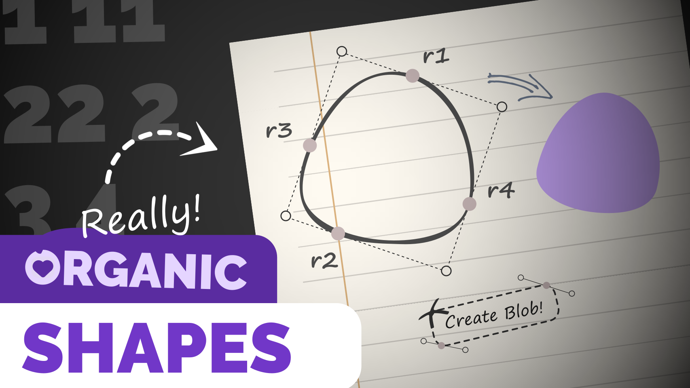

# CSS Blob Maker

   
  Create organic CSS shapes in less effort! 😄

Did you know blobs were born in 2017? It's been 3 years there is a positive impact on UI/UX since designers started using blobs in their designs, clients are really happy with their work, their sense of design. Without the organic shapes placed around the design might kill the design itself. The blobs are great!

But it can be difficult to create organic blob shapes on the fly or when you need a number of different shapes and there is a tight deadline hanging in front of us. CSS can help you, just hit that purple button and smash it until you get the magic shape you desired!

While `border-radius` is mostly used to create a circle by setting it to 50%, there are some awesome things we can do, specifying up to eight values separated by a slash! Again, finding the right values can be tough, but we've nailed for you. 😀

Check out the work on CodePen — https://codepen.io/shadow-scientist/pen/BaKdyMJ

### Why it was made in the first place?
To prove - 
“The Image is set round just by using the well-supported border-radius. Don’t forget that old CSS still exists and is useful. You don’t need to use something fancy for every effect.” — Rachel Andrew

### News!
I'm going to release a tutorial of this project! Here is the poster (thumbnail, I guess) —  

  

 
Find it on Youtube: <a href="shadow-scientist.github.io/youtube">Shadow Scientist</a>

### Read More
🔹 https://9elements.com/blog/css-border-radius/ 
🔹 https://developer.mozilla.org/en-US/docs/Web/CSS/border-radius 
🔹 https://medium.com/@usonesinbetween/2017-the-year-of-the-blob-a3d899c9b071

### Grab the Awesome Editor from 9elements!
🔹 https://9elements.github.io/fancy-border-radius/full-control.html

Have a great one! Enjoy! 😊
